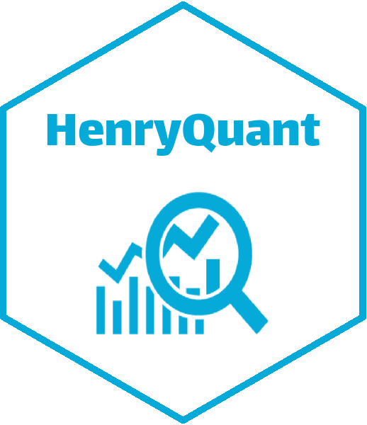

<!-- README.md is generated from README.Rmd. Please edit that file -->

```{r, echo = FALSE}
knitr::opts_chunk$set(
  collapse = TRUE,
  comment = "#>",
  fig.path = "man/figures/README-"
)
```

# HenryQuant


## Usage

금융 데이터 수집 및 처리, 포트폴리오 구성 등 퀀트 투자에 필요한 함수를 제공합니다.

## Installation

다음 코드를 통해 패키지를 다운로드 받을 수 있습니다.
<br>
(`devtools` 패키지가 미리 설치되어 있어야 합니다.)

```{r eval = FALSE}
devtools::install_github("hyunyulhenry/HenryQuant")
library(HenryQuant)
```

## More Information

http://henryquant.blogspot.kr/
